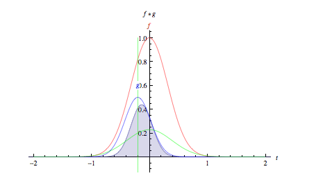
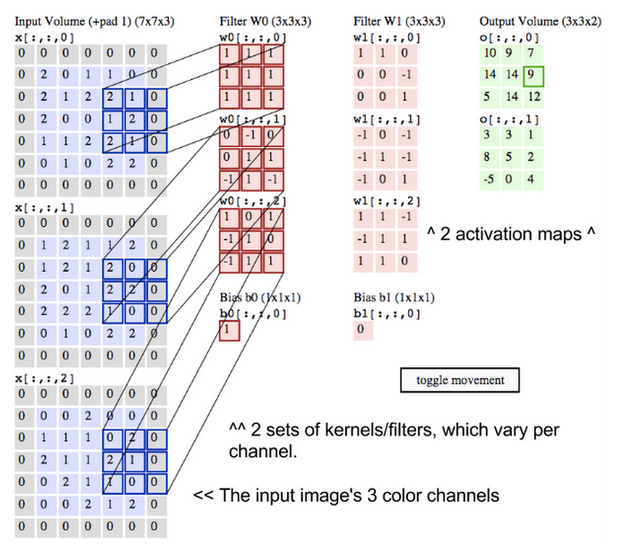
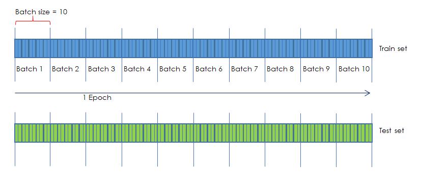
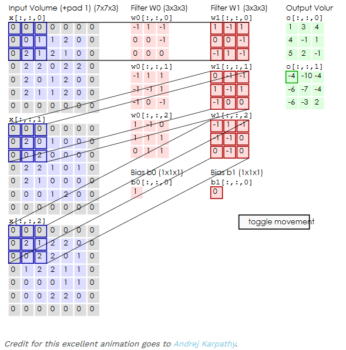

***Name:*** Krishna Prabu D 

***Batch number:*** EIP 3.0 / Batch 7

**Assignment 1C**

<u>Topics covered</u>

- Convolution

- Filters / Kernels

- Epoch

- 1x1 kernel

- 3x3 kernel

- # *1. Convolution*

Convolution can be thought of as a mathematical Operator that applies the effects of a operand which can itself be a n dimension vector or vector set on an Object defined as a vector or vector set. For example, a Convolution operator applied on two sinusoidal wave will result in the combined effect of both. It can be the overlapping effect of 2 or more sound waves or Electrical signals with different phases etc.,





```english

```

# *2. Filters/Kernels*

As mentioned above, in a Convolution Neural Network, a Image of nxn pixels represented in the form of a nxn dimensional matrix with 3 channels representing respective RGB channels. A filter or a kernel of mxm matrix can be convoluted upon the nxn image vector to extract features from the image like vertical, horizontal or diagonal separators.



Typically there will be more than 1 kernel applied on the image so that each convolution operation results in extraction of different features.


# *3. Epoch*

If we have a archive of say 10million images of different classes of objects that we want our DNN to identify, then it is a very compute intensive process to use all these images for passing through the DNN for training the model.

So, a representative sample set of images are taken as Train set and another similar but non-overlapping set as Test set.



The Train and Test sets are in turn split into batches of say n images each. For example, a sample set of 100 images can be split into batch sizes of 10 images in each batch. 1 full passing of the entire set of 100 images or 10 batches of 10 images per batch through a DNN is called 1 Epoch. Passing through the DNN includes one full cycle of forward and backward propogation completed for all 100 images in 10 batches.

# *4. 1x1 Convolution*

1x1 kernal convolution with another convolution layer is used for filtering out the most important neurons in a network layer preceeding the current one. 1x1 convolutions are typically applied after several layers of nxn convolutions.

1x1 are also applied prior to applying a Maxpooling or AvgPooling to be more effective.

1x1 applied directly on a image don't make sense as the features wouldn't be segregated yet to filter the most important or stronger activations / connections

# *5. 3x3 Convolution*

Most commonly used Kernel is 3x3 matrix with a stride of 1 or 2. Several layers of 3x3 convolutions are applied on an image of 1 or more channels. These are primarily used for extracting the features like vertical, horizontal or diagnal borders, relationship between colour channels and so on.



The number of kernels convoluted in different layers can be gradually increased for effective segregation of features.

